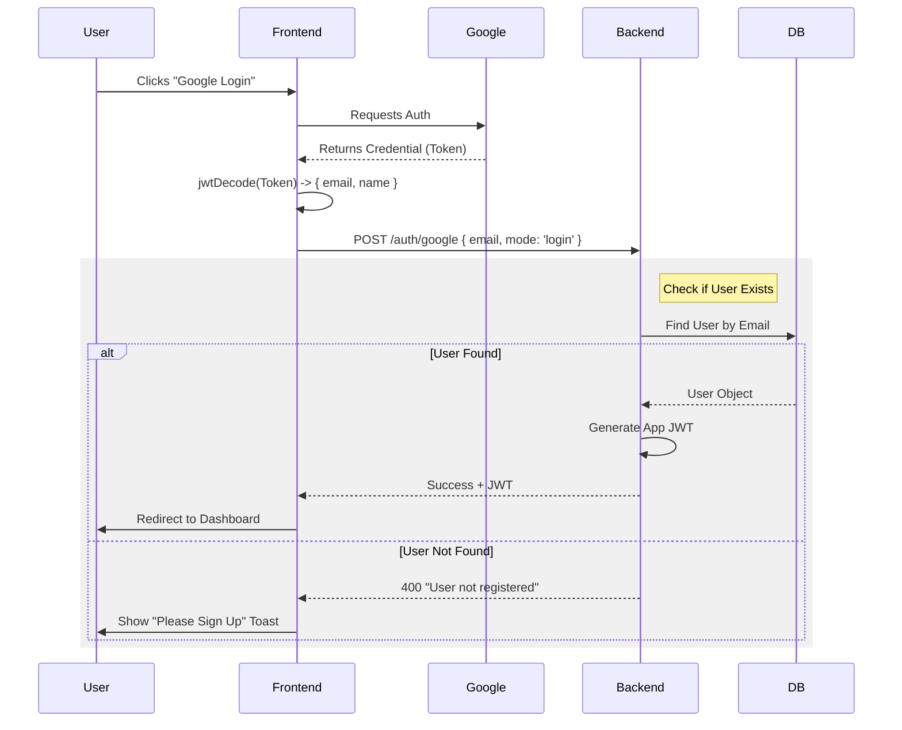

# Google Authentication 
## 1. High-Level Workflow

Unlike a standard email/password login, Google Auth delegates the "password check" to Google.

1.  **Frontend**: User clicks "Sign in with Google".
2.  **Google**: Validates the user (asks for their password/2FA) and returns a **Credential Token**.
3.  **Frontend**: Decodes this token to get the email, name, and picture.
4.  **Backend**: We send this email to our backend to check:
    *   *Does this user exist in our DB?*
    *   *If yes*: Log them in (Generate our own JWT).
    *   *If no*: Ask them to select a Role (Investor/Startup) before creating the account.

---

## 2. Frontend Implementation (`frontend/src`)

### A. Setup: The Provider
**File:** `main.jsx`
We wrap the entire application in `GoogleOAuthProvider`. This gives all components access to the Google SDK.
```javascript
<GoogleOAuthProvider clientId="YOUR_GOOGLE_CLIENT_ID">
  <App />
</GoogleOAuthProvider>
```

### B. The Login Button
**File:** `Login.jsx`
We use the `<GoogleLogin />` component from the library `@react-oauth/google`.
-   **onSuccess**: This helps when Google successfully verifies the user. It returns an encrypted `credential`.

### C. Processing the Token
**File:** `Login.jsx` -> `handleGoogleLogin`
We cannot read the Google token directly, so we use `jwt-decode`.

```javascript
import { jwtDecode } from "jwt-decode";

const handleGoogleLogin = async (response) => {
    // 1. Decode the Google Token
    const user = jwtDecode(response.credential); 
    // user = { email: "...", name: "...", picture: "..." }

    // 2. Send to Backend
    const res = await api.post("/auth/google", {
        mode: "login",
        email: user.email,
        // ...
    });

    // 3. Handle Result
    if (res.data.token) {
        // Success: User exists, log them in
        login(res.data.token, res.data.user.role);
    } else {
        // Error: User not found, need to Sign Up
    }
};
```

---

## 3. Backend Implementation (`backend/controllers`)

### A. The Logic (`GoogleLogin`)
**File:** `authController.js`
The backend doesn't check a password. It trusts that if the request has the correct email (verified by frontend's Google flow), the user is who they say they are.

**Crucial Logic: Authentication vs. Registration**
Since your app requires a **Role** (Investor vs Startup), and Google doesn't know that, we have a two-step process:

1.  **Login Request**:
    ```javascript
    // authController.js
    const user = await User.findOne({ email });
    
    if (user) {
        // User exists -> Generate our App's JWT
        return res.status(200).json({ token: createToken(...) });
    } else {
        // User NOT found -> Return Error
        return res.status(400).json({ message: "User not registered" });
    }
    ```

2.  **Registration Request** (Handled in `Signup.jsx` / `RegisterRole`):
    If the user performs the Google flow on the *Signup* page, they are eventually directed to pick a role. Then call `RegisterRole` to actually create the user in the database.

---

## 4. Visualizing the Flow



## 5. Summary Key Libraries
*   **@react-oauth/google**: Provides the React components and hooks to interact with Google's Identity Services.
*   **jwt-decode**: A small library to decode the Base64Url encoded JWT token returned by Google so we can read the user's `email` and `name` on the frontend.
