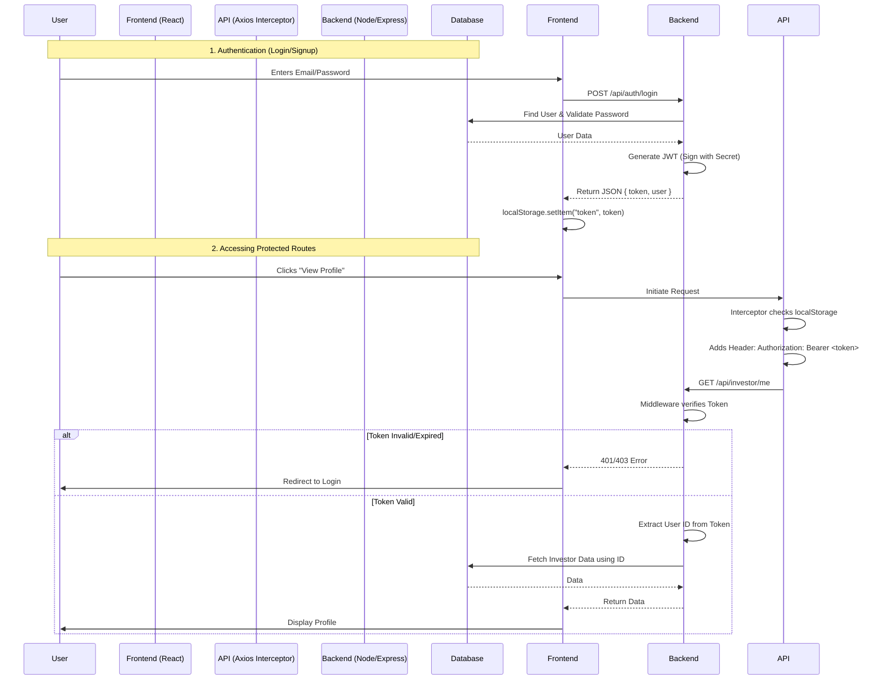

# l (JSON Web Token) - Concept & Implementation Guide

This document explains what JWT is, why it is used, and details its specific implementation in your `InvestMatch` application. This guide is designed to be helpful for understanding the code and for technical interview preparation.

## 1. What is JWT?

**JWT (JSON Web Token)** is an open standard (RFC 7519) that defines a compact and self-contained way for securely transmitting information between parties as a JSON object. This information can be verified and trusted because it is digitally signed.

A JWT is composed of three parts separated by dots (`.`):
1.  **Header**: Contains metadata about the type of token (JWT) and the signing algorithm (e.g., HS256).
2.  **Payload**: Contains the "claims" (data). This is where we store user information like `id`, `email`, or `role`.
3.  **Signature**: Generated by taking the encoded header, encoded payload, and a secret key (from your `.env` file). It ensures the token hasn't been altered.

**Format:** `Header.Payload.Signature`

---

## 2. Why use JWT?

In your application, JWT is used for **Stateless Authentication**.

*   **Stateless**: The server does not need to keep a record of which users are currently logged in (no sessions in the database or memory). The token itself contains all the necessary proof of identity.
*   **Scalability**: Since the server doesn't hold session data, it's easier to scale across multiple servers (e.g., on Render).
*   **Security**: The signature ensures that if a malicious user tries to change their role from "user" to "admin" in the payload, the signature verification will fail.

---

## 3. Where and How is it Used in Your Code?

The following diagram visualizes the flow of data and control when using JWT in your application:



The JWT flow in your application consists of four main steps: **Generation**, **Storage**, **Transmission**, and **Verification**.

### Step 1: Generation (Backend)
**Location:** `backend/controllers/authController.js`

When a user logs in or signs up, the server validates their credentials. If valid, it creates (signs) a new JWT.

**Code Reference:**
```javascript
// Inside login function
const token = jwt.sign({
    id: existingUser._id,    // Payload: User ID
    email: existingUser.email // Payload: Email
}, process.env.JWT_SECRET,   // Secret Key: Used to sign the token
{ expiresIn: process.env.JWT_EXPIRES_IN }); // Option: Expiration time
```
*   **Explanation**: We pack the user's `id` into the token so we can identify them later without querying the database for every single request.

### Step 2: Storage (Frontend)
**Location:** Frontend Components (Login/Signup)

Once the backend sends the `token` back to the frontend (in the JSON response), the frontend stores it. In your app, you are using **localStorage**.

*   **Logic**: `localStorage.setItem("token", response.data.token)`
*   **Why**: This persists the login state even if the user refreshes the page.

### Step 3: Transmission (Frontend)
**Location:** `frontend/src/utils/api.js`

For every subsequent request to a private route (like "get my profile"), the frontend must send this token to prove identity. You use an **Axios Interceptor** to do this automatically.

**Code Reference:**
```javascript
api.interceptors.request.use((config) => {
    const token = localStorage.getItem("token"); // Retrieve token
    if (token) config.headers.Authorization = `Bearer ${token}`; // Attach to header
    return config;
})
```
*   **Explanation**: This code runs before *every* API call defined in `api.js`. It attaches the token to the `Authorization` header in the standard format: `Bearer <token>`.

### Step 4: Verification (Backend)
**Location:** `backend/middleware/authMiddleware.js`

This middleware sits in front of protected routes. It checks if the incoming request has a valid token.

**Code Reference:**
```javascript
const auth = async (req, res, next) => {
    // 1. Get token from header
    const token = req.headers.authorization?.split(" ")[1]; 

    // 2. Verify token
    const decoded_message = jwt.verify(token, process.env.JWT_SECRET);
    
    // 3. Attach user ID to request object
    req.userId = decoded_message.id;
    
    // 4. Proceed to the next controller
    next();
}
```
*   **Explanation**: 
    -   `jwt.verify` decodes the token. If the signature is invalid (wrong key) or expired, it throws an error.
    -   `req.userId = decoded_message.id` extracts the user ID we put in during Step 1. This allows the next function (e.g., `getProfile`) to know *who* is making the request (`req.userId`).

---

## 4. Interview Cheat Sheet

**Q: What is the purpose of `process.env.JWT_SECRET`?**
**A:** It is a private key known only to the server. It is used to generate the signature part of the token. If an attacker changes the payload, they cannot generate a valid new signature without this secret.

**Q: What happens if the token expires?**
**A:** The `jwt.verify` function in the middleware will throw a `TokenExpiredError`. The middleware will catch this and usually respond with a 401 or 403 status, prompting the frontend to log the user out or ask for re-login.

**Q: Why do we store the token in LocalStorage?**
**A:** To persist the user's session across page reloads. However, for higher security (to prevent XSS attacks), HttpOnly cookies are sometimes recommended, but LocalStorage is the most common approach for Single Page Applications (SPAs) like React.

**Q: What is `Bearer` in the header?**
**A:** It is an authentication scheme. It indicates that the client is presenting a "bearer token"—meaning "give access to the bearer of this token."
