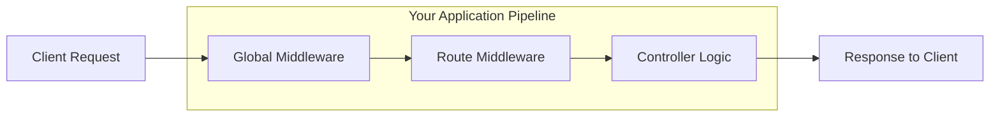

# Middleware - Concept & Implementation Guide

This document explains what Middleware is, why it is used, and details its specific implementation in your `InvestMatch` application. This guide is designed to be helpful for understanding the code and for technical interview preparation.

## 1. What is Middleware?

**Middleware** is software that acts as a bridge between an operating system or database and applications, especially on a network. In the context of **Express.js** (your backend framework), middleware functions are functions that have access to the **Request object (req)**, the **Response object (res)**, and the **next middleware function** in the application’s request-response cycle.

Think of it as a **processing pipeline**. When a request hits your server, it passes through a series of middleware functions. Each one can either:
1.  **Execute code**: Log something, parse data, etc.
2.  **Modify** the request or response objects (e.g., adding `req.userId`).
3.  **End** the request-response cycle (send a response back).
4.  **Call** the next middleware in the stack (`next()`).

---

## 2. Visualizing Middleware



---

## 3. Types of Middleware in Your App

Your application uses three main types of middleware: **Built-in**, **Third-party**, and **Custom**.

### A. Global Middleware (Applied to Every Request)
**Location:** `backend/server.js`

These are added using `app.use()` directly on the app instance. They run for *every* code path.

1.  **CORS (Third-party)**:
    ```javascript
    app.use(cors({ origin: [...] }));
    ```
    *   **Purpose**: Allows your frontend (running on a different port/domain) to communicate with your backend. Without this, the browser blocks the request for security.

2.  **Body Parser (Built-in)**:
    ```javascript
    app.use(express.json());
    ```
    *   **Purpose**:  It takes the raw JSON data sent in a POST request body and converts it into a JavaScript object accessible via `req.body`. Without this, `req.body` would be undefined.

### B. Route-Level Middleware (Applied to Specific Routes)
**Location:** `backend/routes/chatRoutes.js`

These are effectively "Guards". They are placed *before* the controller function in the route definition.

**Code Example:**
```javascript
// From chatRoutes.js
router.get("/users", authMiddleware, getChatUsers);
```
*   **Flow**: 
    1. Request hits `/users`.
    2. `authMiddleware` runs first.
    3. If `authMiddleware` calls `next()`, then `getChatUsers` runs.
    4. If `authMiddleware` sends an error (res.status(401)), `getChatUsers` **never** runs.

### C. Custom Middleware (You Wrote This)
**Location:** `backend/middleware/authMiddleware.js`

**Code Explanation:**
```javascript
const auth = async (req, res, next) => {
    // 1. CHECKS: Is there a token?
    const token = req.headers.authorization?.split(" ")[1];
    
    // ... verification logic ...

    // 2. MODIFIES: Adds data to the Request object
    req.userId = decoded_message.id; 

    // 3. CONTINUES: Passes control to the next function
    next(); 
}
```
*   **Why is this Middleware?** Because it sits *in the middle* between the raw request and the final controller logic. It prepares the request (by verifying user identity) so the controller specifically focuses on business logic.

---

## 4. Interview Cheat Sheet

**Q: What is the `next()` function?**
**A:** It is a function passed to the middleware that, when called, executes the *next* middleware in the stack. If you don't call `next()` (and don't send a response), the request will hang and eventually time out.

**Q: In what order does middleware run?**
**A:** It runs sequentially in the order it is defined with `app.use()`. This is why `cors` and `express.json` are usually at the top of `server.js`—we want them to handle the request *before* our routes try to process it.

**Q: Can middleware modify the response?**
**A:** Yes. Middleware can send a response (ending the cycle) or modify response headers. For example, your `authMiddleware` sends a `401` response if the token is missing, effectively blocking the request.

**Q: Why separate middleware from controllers?**
**A:** Separation of Concerns (SoC). We write the authentication logic *once* in `authMiddleware` and reuse it across 50 different routes. If we put that logic in every controller, our code would be repetitive and hard to maintain (DRY Principle - Don't Repeat Yourself).
